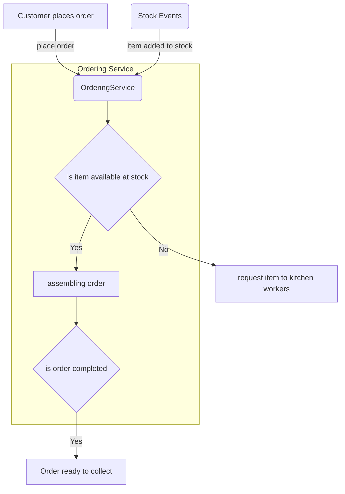
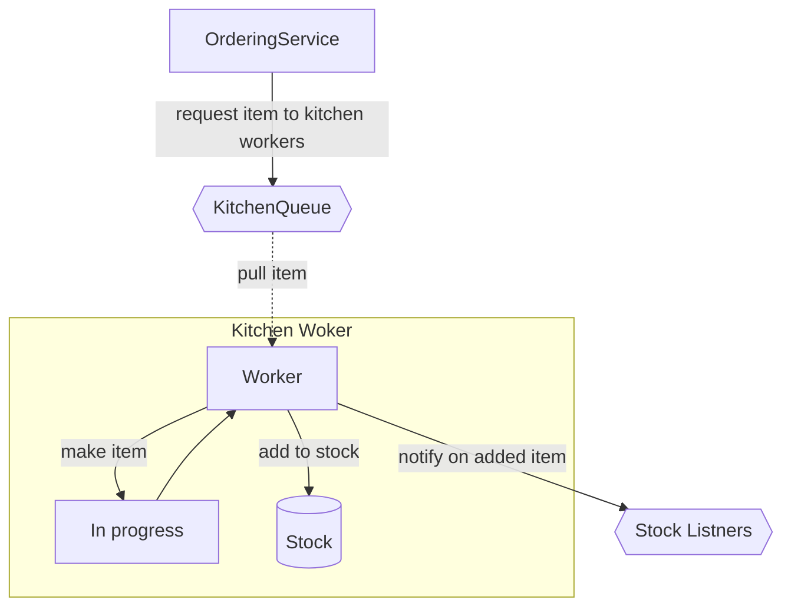

# Purpose of the repository
The main reason for this project is to create a playground to test different concepts, frameworks, and design pattern implementations in the Go language. 
My purpose is to learn the language, and frameworks while working on a real-world use case that will require the involvement of multiple different technologies. 

The following goals are put on this project: 
- [ ] Learn Gin framework to handle REST requests,
- [ ] Learn how to take advantage of Kafka while communicating between different services (process streams for analytics (M2)).
- [ ] Using EventSourcing to communicate between services, persists events on event store db
- [ ] Expose specific data using WebSockets. ***Test different solutions here.
- [ ] Create analytics for estimations from event data.

# McBurger Orders
McBurger Orders is a service that is used to collect meal orders that were purchased by customers. 
Customers get an order number that they can use to monitor what is the status of their order and collect it when ready. 

The Food restaurant contains kitchen workers who prepare menu items on a constant basis. They prepare items needed for assembling one customer order if the item is not in stock. 
The Stock consists of pre-done items that are among the 'favorites'. There is a requirement always to have 3 of each favorite in stock. 
Each Item takes a specific amount of time. It varies between items and also has an additional factor that is randomly added for each item. Let's say a Hamburger takes 180 seconds, but has a variety of 30 seconds. This means that each hamburger can take between 150 to 210 seconds. 

## Business Requirements
- The service is connected with kitchen worker(s) who perform the items that McBurger serves. 
- An automatic process collects all items for a given order automatically. 
- The status of the order changes between the following: REQUESTED/IN_PROGRESS/READY/COLLECTED. 
- A user can read the status of his order from a separate service (order status board). 

### Technical Requirements
- We should use Events for communication between services.
- We should have a REST API that accepts orders and shows the menu.
- FIFO priority on orders
- We don't care about the purchase of the order, no validation is needed there.
- A different service should be exposing the orders status board, via WebSockets or long-pulling.
- MongoDB as db state. For simplicity, it can be shared among services.
- The number of kitchen workers, can be added on the config level, at start-up only.
- The workers will prepare missing favorite items when no item is required. (Can be changed by FF.1)

  
#### FeatureFlag Option.1 
The Kitchen worker must make favorite items if they are missing before picking up any other orders.

-----------
## SOLUTION
<Diagram>

##### Ordering Service
Collecting customer orders, creates a new order in the system. Is responsible for taking items from stock needed for the order.
Places orders to kitchen workers when the item is not avaiable on the stock. 

##### Kitchen Workers service. 
X number of workers that collect items requests and make them. Pushes ready items to the stock to be picked up by the Ordering service. 

##### Order Status service
Returns the Order status for all achtive orders placed in the system.

